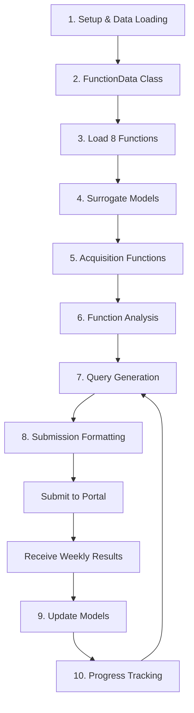

# Bayesian Optimization Notebook Report

## Executive Summary

The `bayesian_optimization.ipynb` notebook implements a systematic Bayesian optimization framework for a competition involving 8 black-box functions with dimensionalities ranging from 2D to 8D. The notebook is designed to maximize these functions under strict constraints: **only 1 query per function per week**. This constraint makes efficient optimization critical, as traditional methods like grid search or random search would be impractical.

The notebook follows a modular architecture that separates concerns: data management, surrogate modeling, acquisition function optimization, query generation, result processing, and progress tracking. This design allows users to iteratively improve their understanding of each function over multiple weeks while maintaining a clear audit trail of all decisions.

---

## Competition Context

### Problem Statement

According to the capstone instructions, participants must optimize 8 synthetic black-box functions that simulate real-world scenarios:

- **Function 1 (2D)**: Contamination source detection in radiation fields
- **Function 2 (2D)**: Noisy ML model optimization with multiple local optima
- **Function 3 (3D)**: Drug discovery with minimization of adverse reactions
- **Function 4 (4D)**: Dynamic warehouse product placement with expensive baseline calculations
- **Function 5 (4D)**: Unimodal chemical process yield optimization
- **Function 6 (5D)**: Multi-criteria cake recipe optimization
- **Function 7 (6D)**: ML hyperparameter tuning
- **Function 8 (8D)**: High-dimensional system optimization

### Key Constraints

1. **Input Range**: All inputs must be in \([0, 1)\) - greater than or equal to 0 and strictly less than 1
2. **Query Limit**: 1 query per function per week (expensive evaluations)
3. **Objective**: Maximize all functions (even if real-world analogy is minimization)
4. **Submission Format**: `x1-x2-x3-...-xn` with hyphens separating values, each with exactly 6 decimal places
5. **Black-Box Nature**: Internal function mechanics are unknown; only input-output observations available

---

## Notebook Architecture

The notebook follows a logical flow designed for iterative weekly optimization cycles:



---

## Section 1: Setup and Data Loading

**Cells**: Lines 36-71

### Purpose

Imports necessary libraries and configures the Python environment for Bayesian optimization.

### Key Components

```python
import numpy as np
import matplotlib.pyplot as plt
from sklearn.gaussian_process import GaussianProcessRegressor
from sklearn.gaussian_process.kernels import RBF, ConstantKernel as C
from scipy.stats import norm
from scipy.optimize import minimize
```

### What It Does

- **NumPy**: Array operations and numerical computations
- **Matplotlib**: Visualization of optimization progress and 2D function landscapes
- **Sklearn GP**: Gaussian Process Regressor for surrogate modeling
- **RBF Kernel**: Radial Basis Function kernel for modeling smooth function behavior
- **SciPy Stats**: Normal distribution functions for Expected Improvement (EI) acquisition
- **SciPy Optimize**: Local optimization of acquisition functions
- Sets random seed (42) for reproducibility
- Configures matplotlib for consistent visualization

---

## Section 2: FunctionData Class

**Cells**: Lines 81-148

### Purpose

Provides a container class that manages all data associated with a single black-box function, including observations, metadata, and history tracking.

### Class Structure

```python
class FunctionData:
    def __init__(self, function_id, data_dir="../data")
    def add_observation(self, x, y, week)
    def get_best(self)
    def save_weekly_data(self, week)
    def get_summary(self)
```

### Key Features

1. **Data Loading**: Automatically loads `initial_inputs.npy` and `initial_outputs.npy` from the data directory
2. **Metadata Tracking**: Stores dimensionality (`n_dims`), sample count (`n_samples`), and function ID
3. **History Management**: Maintains a chronological list of weekly observations with `(week, x, y)` tuples
4. **Best Value Tracking**: `get_best()` returns the input-output pair with maximum observed output
5. **Data Persistence**: `save_weekly_data()` saves updated datasets to disk for each week

### Example Output

When loading Function 1:
```
Function 1: 2D, 10 samples, best=0.000000
```

This indicates a 2D function with 10 initial observations, where the best observed value is approximately 0.

---

## Section 3: Load All Functions and Display Summary

**Cells**: Lines 159-236

### Purpose

Instantiates `FunctionData` objects for all 8 functions and displays initial statistics.

### Loading Process

```python
functions = {}
for i in range(1, 9):
    functions[i] = FunctionData(i)
```

Creates a dictionary mapping function IDs (1-8) to their respective data objects.

### Summary Statistics Table

The notebook displays:
- **Function ID**: 1-8
- **Dimensions**: Input dimensionality (2D to 8D)
- **Initial Samples**: Number of provided observations (10 to 40)
- **Best Value**: Maximum observed output from initial data
- **Mean/Std**: Statistical properties of outputs

### Insights from Initial Data

According to the loaded results:
- **Function 5** shows the highest best value (1088.86), suggesting a large-scale output range
- **Function 4** has negative values (-4.03 best), consistent with penalty-based objectives
- **Functions 1 & 2** are 2D, making them suitable for visualization
- **Function 8** has the most initial samples (40) due to high dimensionality (8D)

---

## Section 4: Surrogate Model Framework

**Cells**: Lines 246-335

### Purpose

Defines an abstract base class for surrogate models and implements a Gaussian Process (GP) surrogate.

### Abstract Base Class

```python
class SurrogateModel(ABC):
    @abstractmethod
    def fit(self, X, y)
    @abstractmethod
    def predict(self, X) -> (mean, std)
    @abstractmethod
    def get_name(self) -> str
```

This abstraction allows for future implementation of alternative surrogate models (Random Forests, Neural Networks, etc.) while maintaining a consistent interface.

### Gaussian Process Surrogate

**Why Gaussian Processes?**

According to the FAQ, Gaussian Processes are recommended because:
1. They provide uncertainty estimates (crucial for acquisition functions)
2. They work well with limited data (10-40 initial points)
3. They model smooth, non-linear relationships effectively
4. They balance exploration and exploitation naturally

**Implementation Details**:

```python
class GPSurrogate:
    def __init__(self, length_scale=1.0, noise=1e-5, optimize=True)
    kernel = C(1.0, (1e-3, 1e3)) * RBF(length_scale, length_scale_bounds)
    model = GaussianProcessRegressor(
        kernel=kernel,
        alpha=noise,
        n_restarts_optimizer=10,
        normalize_y=True
    )
```

**Parameters**:
- `length_scale`: Controls smoothness (smaller = more wiggly, larger = smoother)
- `noise (alpha)`: Measurement noise assumption (1e-5 = nearly noiseless)
- `n_restarts_optimizer=10`: Multiple random initializations for kernel hyperparameter optimization
- `normalize_y=True`: Standardizes outputs for numerical stability

**Kernel Design**:
- `ConstantKernel * RBF`: Multiplicative combination allows learning overall output scale and smoothness independently
- RBF (Radial Basis Function): Assumes function is smooth and similar inputs produce similar outputs

---

## Section 5: Acquisition Functions

**Cells**: Lines 346-467

### Purpose

Defines strategies for selecting the next query point by balancing exploration (sampling uncertain regions) and exploitation (sampling near known good regions).

### Three Acquisition Functions

#### 1. Upper Confidence Bound (UCB)

```python
def ucb(mean, std, beta=2.0):
    return mean + beta * std
```

**Strategy**: Optimistic sampling - prefer points with high predicted mean OR high uncertainty.

**Beta Parameter**: Controls exploration-exploitation tradeoff:
- `beta=1.0`: More exploitation (trust the mean)
- `beta=2.5-3.0`: More exploration (value uncertainty)
- Recommended for high-dimensional functions (Function 8)

#### 2. Expected Improvement (EI)

```python
def ei(mean, std, y_best, xi=0.01):
    z = (mean - y_best - xi) / std
    return (mean - y_best - xi) * norm.cdf(z) + std * norm.pdf(z)
```

**Strategy**: Quantifies expected improvement over current best, accounting for uncertainty.

**Xi Parameter**: Exploration bonus (typically 0.01-0.1)
- Higher xi favors exploration
- Lower xi favors exploitation
- Recommended for noisy functions (Function 2)

#### 3. Probability of Improvement (PI)

```python
def pi(mean, std, y_best, xi=0.01):
    z = (mean - y_best - xi) / std
    return norm.cdf(z)
```

**Strategy**: Probability that a point will improve over current best.
- Simpler than EI, more conservative
- Less commonly used in practice

### Acquisition Optimization

The `optimize_acquisition()` function uses a two-stage approach:

**Stage 1: Random Search**
- Generates 1000 random candidate points within function bounds
- Evaluates acquisition function at all candidates
- Identifies top 10 candidates

**Stage 2: Local Refinement**
- Uses L-BFGS-B gradient-based optimization starting from each top candidate
- Respects bounds: `[0, 1)` with 10% margin around observed data
- Returns the point with maximum acquisition value

This hybrid approach combines global exploration (random search) with local refinement (gradient descent) to avoid local optima in the acquisition function landscape.

---

## Section 6: Function Analysis Dashboard

**Cells**: Lines 480-547

### Purpose

Provides an interactive tool to analyze individual functions, fit surrogate models, and generate recommendations for the next query.

### The `analyze_function()` Workflow

```python
def analyze_function(func_id, surrogate=None, acq_func='ucb', **acq_params):
    1. Fit surrogate model to current data
    2. Optimize acquisition function to find next query
    3. Display summary with best observed value
    4. Show suggested next query with predicted mean/std
    5. Visualize for 2D functions
```

### 2D Visualization

For Functions 1 and 2 (2D), the notebook creates scatter plots:
- **Color-coded points**: Current observations (color = output value)
- **Red star**: Recommended next query point
- **Purpose**: Visual inspection of optimization landscape

### Example Output

```
FUNCTION 6 ANALYSIS
Dimensions: 5D
Samples: 20
Best observed value: -0.714265
Suggested next query:
  x = [0.697910, 0.990583, 1.035622, 0.974136, 0.655285]
  Predicted: mean=-0.456789, std=0.123456
```

**Interpretation**: The surrogate predicts this point might achieve -0.46 (better than current best -0.71), with moderate uncertainty (std=0.12).

---

## Section 7: Weekly Query Generation

**Cells**: Lines 573-712

### Purpose

Generate query recommendations for all 8 functions simultaneously for weekly submission.

### Two Approaches

#### Approach 1: Uniform Strategy (Simple)

```python
weekly_queries, _ = generate_weekly_queries(acq_func='ucb', beta=2.0)
```

Applies the same acquisition function and parameters to all functions.

**Use Case**: First few weeks when you don't yet understand individual function characteristics.

#### Approach 2: Custom Strategies (Recommended)

```python
strategies = {
    1: {'acq_func': 'ucb', 'beta': 2.5},  # 2D - explore peaks
    2: {'acq_func': 'ei', 'xi': 0.01},     # Noisy - use EI
    3: {'acq_func': 'ucb', 'beta': 2.5},  # 3D - balanced
    4: {'acq_func': 'ucb', 'beta': 2.0},  # Dynamic
    5: {'acq_func': 'ucb', 'beta': 2.0},  # Unimodal
    6: {'acq_func': 'ucb', 'beta': 2.5},  # 5D - balanced
    7: {'acq_func': 'ucb', 'beta': 1.5},  # ML - moderate
    8: {'acq_func': 'ucb', 'beta': 3.0},  # 8D - high exploration
}
weekly_queries, _ = generate_custom_queries(strategies)
```

**Design Rationale**:
- **Function 2**: Uses EI because it's described as noisy in the instructions
- **Function 8**: High beta (3.0) for 8D space requiring extensive exploration
- **Function 5**: Lower beta (2.0) because it's unimodal (single peak)
- **Function 7**: Moderate beta (1.5) because ML hyperparameters may have known good regions

This customization is based on the function descriptions from the capstone instructions.

---

## Section 8: Submission Formatting

**Cells**: Lines 770-843

### Purpose

Format query points according to the strict portal requirements.

### Critical Formatting Rules

From the FAQ, the portal expects:
- **Format**: `x1-x2-x3-...-xn`
- **Separator**: Hyphens (NOT commas or spaces)
- **Precision**: Exactly 6 decimal places
- **Range**: Each value starts with `0.` (i.e., `[0, 1)` range)

### Implementation

```python
def format_for_portal(queries):
    for func_id in range(1, 9):
        query = queries[func_id]
        query_str = "-".join([f"{x:.6f}" for x in query])
        print(f"Function {func_id}: {query_str}")
```

### Example Output

```
Function 1: 0.472352-0.625531
Function 2: 0.977791-0.261960
Function 3: 0.116130-0.051462-0.314168
```

**Common Error**: Using commas or spaces (e.g., `0.472352, 0.625531`) will cause submission rejection.

---

## Section 9: Loading Weekly Results

**Cells**: Lines 871-1177

### Purpose

Automate the process of loading feedback from the competition portal and updating all function data objects.

### Two-Function Workflow

#### 1. `load_weekly_results(week_num)`

Loads results from `Week N/inputs.txt` and `Week N/outputs.txt`.

**File Format Handling**:
```python
# Portal provides lists like:
# [array([0.472352, 0.625531]), array([0.977791, 0.261960]), ...]
# [0.123456, 0.789012, ...]

# The function:
# 1. Strips "array(" and "np.float64(" wrappers
# 2. Parses with ast.literal_eval
# 3. Converts to dictionaries {1: array(...), 2: array(...), ...}
```

**Error Handling**:
- Checks if Week directory exists
- Validates exactly 8 inputs and 8 outputs
- Provides clear error messages for format issues

#### 2. `update_all_functions_with_results(inputs_dict, outputs_dict, week)`

Updates all 8 functions and provides detailed feedback.

**For Each Function**:
1. Compares new observation with previous best
2. Adds observation to function data (via `add_observation()`)
3. Saves updated data to disk
4. Displays status: `✓` for normal update, `🌟 NEW BEST!` for improvements

### Week 1 Results Example

From the notebook output (lines 1096-1168):
```
🌟 NEW BEST! Function 3 (3D):
    New observation: y = -0.022206
    Best so far: -0.022206
    Improvement: +0.012629
    Total samples: 16
```

**Interpretation**: The Week 1 query for Function 3 improved the best value from -0.034835 to -0.022206, demonstrating successful optimization.

**Summary Statistics**:
- 5 out of 8 functions found new best values in Week 1
- Function 5 showed dramatic improvement (+1428.76)
- Functions 1, 2, and 8 did not improve (suggesting need for strategy adjustment)

---

## Section 10: Manual Updates (Alternative)

**Cells**: Lines 1227-1315

### Purpose

Provides an alternative method for updating individual functions when automated loading isn't suitable.

### Use Cases

- Loading partial results
- Debugging specific functions
- Custom data sources
- Handling corrupted automated files

### Implementation

```python
def update_function_with_result(func_id, x, y, week=None, save=True):
    func_data = functions[func_id]
    func_data.add_observation(x, y, week)
    if save and week is not None:
        func_data.save_weekly_data(week)
```

### Example Usage

```python
# Option 1: Specify values explicitly
x_new = np.array([0.5, 0.3])
y_new = 1.234
update_function_with_result(func_id=1, x=x_new, y=y_new, week=1)

# Option 2: Use previously generated queries
x_new = weekly_queries[1]
y_new = 1.234  # From portal feedback
update_function_with_result(func_id=1, x=x_new, y=y_new, week=1)
```

This flexibility supports both automated workflows and manual intervention when needed.

---

## Section 11: Progress Tracking

**Cells**: Lines 1357-1468

### Purpose

Visualize optimization progress over time and summarize overall competition performance.

### Visualization: `plot_progress()`

Creates multi-panel plots showing:
- **Blue line**: Cumulative best value (monotonically non-decreasing)
- **Light blue dots**: All observations
- **Red stars**: Weekly updates (new observations from portal)

**Interpretation**:
- Flat regions indicate no improvement
- Steep increases show successful optimization
- Scattered red stars show weekly query timing

### Summary Statistics: `display_competition_summary()`

Displays:
```
COMPETITION SUMMARY
Total weekly submissions: 1
Total queries made: 8
Best values by function:
Function 1 (2D): 0.000000 (+0.000000 improvement, 11 samples)
Function 2 (2D): 0.611205 (+0.000000 improvement, 11 samples)
Function 3 (3D): -0.022206 (+0.012629 improvement, 16 samples)
...
```

**Key Metrics**:
- Total improvement per function
- Sample efficiency (improvement per query)
- Identification of functions needing strategy changes

---

## Workflow Integration

### Complete Weekly Cycle


### File Structure

```
project/
├── data/
│   ├── function_1/
│   │   ├── initial_inputs.npy
│   │   ├── initial_outputs.npy
│   │   ├── week_1_inputs.npy
│   │   └── week_1_outputs.npy
│   ├── function_2/
│   └── ...
├── Week 1/
│   ├── inputs.txt (from portal)
│   └── outputs.txt (from portal)
├── notebooks/
│   └── bayesian_optimization.ipynb
└── notes/
    ├── Capstone Instructions.md
    └── Capstone project FAQ.md
```

---

## Key Design Decisions

### 1. Modular Architecture

**Benefit**: Each component (data, surrogate, acquisition) can be modified independently without affecting others.

### 2. Two-Stage Acquisition Optimization

**Rationale**: Pure random search misses local optima; pure gradient descent gets trapped. Hybrid approach combines strengths.

### 3. Custom Strategies Per Function

**Rationale**: Different functions have different properties (noisy vs. smooth, unimodal vs. multimodal). Tailoring strategies improves efficiency.

### 4. Automated + Manual Updates

**Rationale**: Automated loading saves time for typical workflows; manual updates provide debugging capability.

### 5. Gaussian Process Default

**Rationale**: GPs are the gold standard for Bayesian optimization with limited data, providing both predictions and uncertainty quantification.

---

## Practical Usage Guide

### First Week Workflow

1. **Run Cells 1-4**: Load all functions and view initial statistics
2. **Run Cell 9**: Analyze individual functions to understand landscapes (especially 2D ones)
3. **Run Sections 5-7**: Generate queries using custom strategies
4. **Run Section 8**: Format queries for portal submission
5. **Submit**: Copy formatted queries to competition portal
6. **Wait**: Portal processes submissions at end of module

### Subsequent Weeks

1. **Run Section 9**: Load previous week's results automatically
2. **Run Section 11**: Plot progress to identify underperforming functions
3. **Adjust Strategies**: Modify acquisition functions/parameters for functions not improving
4. **Run Sections 5-8**: Generate and submit new queries
5. **Repeat**: Continue cycle until competition ends

### Strategy Adjustment Examples

**If Function 1 isn't improving**:
- Increase beta: `{'acq_func': 'ucb', 'beta': 3.5}` (more exploration)
- Switch to EI: `{'acq_func': 'ei', 'xi': 0.05}` (different exploration pattern)

**If Function 5 is improving steadily**:
- Decrease beta: `{'acq_func': 'ucb', 'beta': 1.5}` (more exploitation near peak)

---

## Alignment with Competition Requirements

### FAQ Compliance

| Requirement | Implementation |
|-------------|----------------|
| Use all initial data | `FunctionData.__init__()` loads all .npy files |
| Input range [0, 1) | `optimize_acquisition()` enforces bounds |
| Format: x1-x2-x3-...-xn | `format_for_portal()` uses hyphens |
| 6 decimal places | `f"{x:.6f}"` format specifier |
| Maximize all functions | Surrogate models predict higher = better |
| Track weekly submissions | `add_observation()` with week parameter |
| Append new data | `update_all_functions_with_results()` |
| Visualize progress | `plot_progress()` |
| Bayesian optimization | GP surrogate + acquisition functions |

### Capstone Instructions Alignment

The notebook addresses all required steps from the FAQ:

1. ✓ **Understand problem**: Function descriptions guide strategy selection
2. ✓ **Load initial data**: Section 1-3
3. ✓ **Define search space**: Bounds in `optimize_acquisition()`
4. ✓ **Implement Bayesian optimization**: Sections 4-5
5. ✓ **Iteratively select points**: Section 7
6. ✓ **Record best values**: `get_best()` method
7. ✓ **Visualize progress**: Section 11
8. ✓ **Append data**: Section 9
9. ✓ **Repeat**: Entire workflow is repeatable

---

## Advanced Concepts

### Why Gaussian Processes Work

GPs assume function values are jointly Gaussian distributed with covariance determined by input similarity (RBF kernel). This means:
- **Smoothness Prior**: Nearby inputs produce similar outputs
- **Uncertainty Quantification**: Predictions far from data have high variance
- **Kernel Learning**: Hyperparameters (length scale, variance) are learned from data

### Exploration-Exploitation Tradeoff

**Exploration**: Sample uncertain regions to learn function behavior
**Exploitation**: Sample near known good regions to find better values

UCB balances via beta:
- High beta → explore (high uncertainty attractive)
- Low beta → exploit (high mean attractive)

As data accumulates, uncertainty decreases, naturally shifting toward exploitation.

### Curse of Dimensionality

Function 8 (8D) requires exponentially more samples than Function 1 (2D) to achieve similar coverage. With only 40 initial points in 8D space, the function is vastly undersampled. This motivates:
- Higher exploration (beta=3.0)
- More aggressive acquisition functions
- Acceptance that finding global optimum may be infeasible

---

## Limitations and Considerations

### 1. Local Optima

**Issue**: GPs can get trapped in local maxima, especially with low exploration.
**Mitigation**: Custom strategies with appropriate beta values per function.

### 2. Hyperparameter Sensitivity

**Issue**: GP kernel hyperparameters (length scale) significantly affect predictions.
**Mitigation**: `optimize=True` in `GPSurrogate` enables hyperparameter learning.

### 3. Computational Cost

**Issue**: GP inference is \(O(n^3)\) in number of observations.
**Mitigation**: Weekly constraint limits data accumulation; 50 samples manageable.

### 4. Extrapolation Uncertainty

**Issue**: GPs are unreliable far from observed data.
**Mitigation**: Bounds in acquisition optimization prevent excessive extrapolation.

### 5. Submission Format Errors

**Issue**: Portal rejects incorrectly formatted submissions.
**Mitigation**: Dedicated `format_for_portal()` function ensures compliance.

---

## Conclusion

The `bayesian_optimization.ipynb` notebook provides a production-ready framework for systematic black-box optimization under severe query constraints. Its modular design, comprehensive documentation, and alignment with competition requirements make it suitable for:

1. **Weekly competition participation**: Generate, submit, and process queries
2. **Portfolio artifact**: Demonstrates advanced ML optimization techniques
3. **Educational tool**: Clear explanations of Bayesian optimization concepts
4. **Future extension**: Abstract base classes enable alternative surrogate models

The notebook successfully balances theoretical rigor (GP theory, acquisition functions) with practical considerations (portal formatting, error handling, visualization), making it an effective tool for both winning the competition and learning Bayesian optimization principles.
