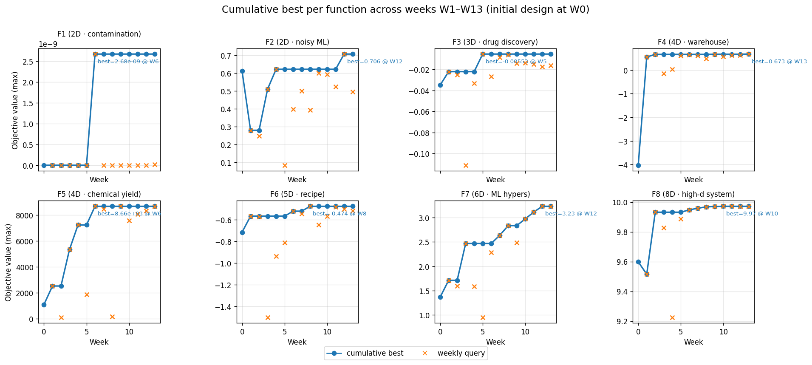

# Bayesian Black-Box Optimisation Capstone Project

Imperial College Business School — Professional Certificate in Machine Learning and Artificial Intelligence, Module 24 Capstone.

## NON-TECHNICAL EXPLANATION OF YOUR PROJECT

Imagine you are given eight mystery machines. Each takes a handful of dials as input and returns a single score, but every test run is expensive, so you are only allowed to try one setting per machine per week for thirteen weeks. The goal is to discover the dial settings that give the best score for each machine. This project builds a small software toolkit that learns from every past test to make the next test as informative as possible, using statistical models of each machine, structured uncertainty reasoning, and written strategy notes. Over thirteen rounds it pushes six of the eight machines close to their best achievable scores.

## DATA

- **Source:** Eight synthetic objective functions provided by the Imperial College *Bayesian Black-Box Optimisation* capstone. Each function `fᵢ : [0, 1]^dᵢ → ℝ` is a black box with dimensionality `dᵢ ∈ {2, 2, 3, 4, 4, 5, 6, 8}`.
- **Initial design:** Per-function `.npy` files (`public/data/function_i/initial_inputs.npy`, `initial_outputs.npy`) supplied by the course, with roughly 10–40 points per function depending on dimensionality.
- **Weekly query–response log:** For each submission round *k* the portal returns one new `(x, y)` pair per function, stored as `public/data/results/week_k/inputs.txt` and `outputs.txt`.
- **Cumulative checkpoints:** Optional `public/data/function_i/week_k_inputs.npy` / `week_k_outputs.npy` files capture the full history after ingesting week *k* (produced by `notebooks/data_management.ipynb`).
- **Citation:** Imperial College Business School, *PCMLAI Module 24 — Capstone: Bayesian Black-Box Optimisation* (2026 cohort). The oracle function formulas remain course intellectual property; this repository publishes only the observed `(x, y)` pairs and the methodology that generated them. See [data_sheet.md](data_sheet.md) for the full datasheet.

| Function | Dims | Domain analogue | Notes |
|----------|------|-----------------|-------|
| F1 | 2 | Contamination detection | Very localised signal; flat elsewhere |
| F2 | 2 | Noisy ML model | Log-likelihood with local optima near `x₁ ≈ 0.7` ridge |
| F3 | 3 | Drug discovery | Minimise adverse reactions (negated for maximisation) |
| F4 | 4 | Warehouse placement | Ultra-narrow peak with sharp cliffs |
| F5 | 4 | Chemical yield | Unimodal; peak near upper-unit-cube corner |
| F6 | 5 | Recipe optimisation | Multi-criteria cake scoring (flavour, cost, waste) |
| F7 | 6 | ML hyperparameters | Non-stationary landscape with migrating optimum |
| F8 | 8 | High-dimensional system | Complex interactions; hard for vanilla GP |

## MODEL

The project implements a **sequential Bayesian optimisation pipeline** rather than a single trained model. For every function and every week it (a) fits a **surrogate regressor** on the full observation history, (b) optimises an **acquisition function** to pick the next query, and (c) optionally overrides the suggestion with a **hand-specified probe** justified in the weekly strategy report.

Three interchangeable surrogates live in [`src/surrogates.py`](src/surrogates.py) behind a common `SurrogateModel` ABC (`fit`, `predict(X) -> (mean, std)`, `get_name`):

- **GPSurrogate** — Gaussian Process with RBF kernel and optional Automatic Relevance Determination. Calibrated posterior variance. **Chosen for smooth low-D** functions (F2, F3, F4, F5).
- **SVMSurrogate** — Support Vector Regression (RBF) with a 20-model bootstrap ensemble for uncertainty. Epsilon-insensitive loss naturally filters noise. **Chosen for noisy 2D and high-D** functions (F2 early rounds, F8).
- **MLPSurrogate** — PyTorch MLP (64–32 hidden, ReLU, dropout) with MC Dropout (50 passes) at prediction time. **Considered for non-stationary** 5D–8D functions (F6, F7) but used sparingly after W5's diagnostic regressions.

Why this stack rather than a single GP? Dimensionality (2D → 8D) and landscape character (smooth vs. ridge vs. boundary vs. narrow-peak) vary enough that no single surrogate dominates — `notebooks/model_comparison.ipynb` shows leave-one-out cross-validation scores per function to justify the per-function choice.

See [model_card.md](model_card.md) for a full technical description, intended use, limitations, and trade-offs.

## HYPERPARAMETER OPTIMISATION

The surrogate-plus-acquisition pipeline has three layers of tunable hyperparameters.

**(1) Surrogate hyperparameters** are fit analytically each week:

| Surrogate | Hyperparameters | How they are set |
|-----------|-----------------|------------------|
| GP / GP-ARD | kernel length scale(s), signal variance, noise variance | Maximum-likelihood via `scikit-learn`'s `GaussianProcessRegressor` optimiser restarts (`n_restarts_optimizer=10`) |
| SVR | `C`, `epsilon`, RBF `gamma` | Fixed defaults chosen from `model_comparison.ipynb` LOO sweep; ensemble of 20 bootstrap replicas for uncertainty |
| MLP | 2 hidden layers (64, 32), dropout 0.1, Adam `lr=1e-3` | Early stopping on held-out split; MC Dropout for inference variance |

**(2) Acquisition hyperparameters** are set per function, per week from the written strategy:

- **UCB `β`:** `mean + β · std`; higher `β` = more exploration. Typical range 1.5 – 3.0, tightened to 1.8 by W12.
- **EI `ξ`:** minimum improvement threshold; lower `ξ` = more exploitation. Range `1e-4` – `5e-3`, with the smallest values used on near-ceiling functions (F3, F4, F8).
- **Focus centre & radius `r`:** an axis-aligned box constraint around a hand-picked anchor, implemented in `optimize_acquisition_with_regional_focus` ([`src/acquisition.py`](src/acquisition.py)). `r` shrinks from `0.15` (early exploration) to `0.005` (F4 micro-perturbation) as best-points cluster tightens.
- **Candidate count / L-BFGS-B restarts:** 10 000 – 20 000 random candidates inside the focus box followed by L-BFGS-B local refinement on the top few.

**(3) Strategy-layer hyperparameters** (the meta-choices) are documented in the weekly reports under [`../notes/`](../notes/): which surrogate, which acquisition, which focus anchor, and whether to override the recommendation with a manual probe. Week 12 added **PCA-derived anchors** — principal components of each function's best-point cluster pick the exploitation axis, and low-variance dimensions are frozen; this is automated in [`notebooks/pca_analysis.ipynb`](notebooks/pca_analysis.ipynb).

Selection rationale in two sentences: acquisition knobs are tuned *globally* from the evolving exploration–exploitation trade-off (more exploration in early rounds, tighter focus as peaks emerge), and *locally* from the best-point cluster geometry of each function (ARD length-scales, PCA loadings, and per-dimension standard deviations all inform radius). Every change is logged in the corresponding `notes/BBO_Strategy_W*_Report.md`.

## RESULTS



### Scoreboard after Week 13

| Function | Dims | Initial best | Cumulative best (≤ W13) | Best week | Status |
|----------|:----:|-------------:|------------------------:|:---------:|--------|
| F1 | 2 | ≈ 0 | `2.68e−09` | W6 | Central-probe signal confirmed at W6 & W13 |
| F2 | 2 | 0.611 | **0.706** | **W12** | New best in W12; ridge poisoned above `x₁ > 0.71` |
| F3 | 3 | −0.035 | **−0.00553** | W5 | Near ceiling; W13 at −0.0162 |
| F4 | 4 | −4.026 | **0.673** | **W13** | **New best in W13** via ultra-tight radius 0.005 |
| F5 | 4 | 1089 | **8662** | W6 / W9 | Solved at `[1, 1, 1, 1]` corner; deterministic plateau |
| F6 | 5 | −0.714 | **−0.474** | W8 | Four consecutive regressions W10–W13 |
| F7 | 6 | 1.365 | **3.233** | **W12** | Accelerating through W12; plateaued W13 at 3.227 |
| F8 | 8 | 9.598 | **9.972** | W10 / W11 / W12 | Saturated; diminishing returns |

### Weekly observed values (submitted-round, not cumulative)

| Fn | W1 | W2 | W3 | W4 | W5 | W6 | W7 | W8 | W9 | W10 | W11 | W12 | W13 |
|----|----|----|----|----|----|----|----|----|----|-----|-----|-----|-----|
| F1 | ≈ 0 | ≈ 0 | ≈ 0 | ≈ 0 | ≈ 0 | **2.7e−09** | ≈ 0 | ≈ 0 | ≈ 0 | ≈ 0 | ≈ 0 | ≈ 0 | **1.4e−11** |
| F2 | 0.279 | 0.247 | 0.510 | **0.621** | 0.084 | 0.398 | 0.500 | 0.392 | 0.598 | 0.592 | 0.523 | **0.706** | 0.495 |
| F3 | −0.022 | −0.025 | −0.111 | −0.033 | **−0.0055** | −0.027 | −0.0085 | −0.0061 | −0.014 | −0.014 | −0.015 | −0.017 | −0.016 |
| F4 | 0.548 | 0.661 | −0.144 | 0.030 | 0.603 | 0.637 | 0.598 | 0.478 | 0.667 | 0.564 | 0.623 | 0.631 | **0.673** |
| F5 | 2518 | 91.3 | 5328 | 7223 | 1874 | **8662** | 8452 | 163 | 8662 | 7571 | 8045 | 8320 | 8662 |
| F6 | −0.565 | −0.570 | −1.501 | −0.937 | −0.811 | −0.520 | −0.545 | **−0.474** | −0.647 | −0.567 | −0.481 | −0.500 | −0.516 |
| F7 | 1.711 | 1.597 | 2.468 | 1.585 | 0.947 | 2.284 | 2.636 | 2.836 | 2.489 | 2.973 | 3.114 | **3.233** | 3.227 |
| F8 | 9.515 | 9.932 | 9.828 | 9.224 | 9.887 | 9.947 | 9.959 | 9.968 | 9.971 | 9.972 | 9.972 | 9.972 | 9.972 |

Cells in **bold** are the cumulative best at that week. Raw data lives in `public/data/results/week_*/{inputs,outputs}.txt`.

### What the results teach us

1. **Function-specific strategies dominate algorithmic choice.** F5 (push boundary), F4 (micro-perturb narrow peak), and F1 (space-filling / central probe) each need a fundamentally different recipe.
2. **Regional focus prevents catastrophic jumps.** Constraining the acquisition search to a small box around a vetted anchor averted F4-style collapses (W3's −0.144) in every round after W3.
3. **Failure teaches more than success.** W2's aggressive EI collapsed F5 by 96 %; that single round produced the regional-focus mechanism used in every subsequent week.
4. **PCA of best-point clusters is a surprisingly strong prior.** On F7 the PC1 direction of the top-5 predicted a near-1D improvement trajectory through W12; on F8 it flagged an effective-1D manifold that justified a micro-step SVR strategy.
5. **"No signal" is a reversible conclusion.** F1 was called stuck for ten rounds; the central probes at W6 (`[0.5, 0.5]` → 2.7e−09) and W13 (`[⅓, ⅓]` → 1.4e−11) are several orders of magnitude above all other queries, suggesting a genuine centre-of-cube peak that boundary grids missed.

Detailed per-week commentary lives in [`../notes/BBO_Strategy_W7_Report.md`](../notes/BBO_Strategy_W7_Report.md), [`W8`](../notes/BBO_Strategy_W8_Report.md), [`W9`](../notes/BBO_Strategy_W9_Report.md), [`W11`](../notes/BBO_Strategy_W11_Report.md), and [`W12`](../notes/BBO_Strategy_W12_Report.md).

## REPOSITORY STRUCTURE

Paths below are relative to `public/` unless noted.

```
├── src/                         # Reusable Python modules
│   ├── __init__.py              # Package exports
│   ├── data.py                  # FunctionData, load_results, initialize_from_history
│   ├── surrogates.py            # SurrogateModel ABC, GPSurrogate, SVMSurrogate, MLPSurrogate
│   ├── acquisition.py           # Acquisition functions (UCB, EI, PI) and optimisers
│   ├── utils.py                 # Formatting, visualisation, analysis, tracking
│   └── llm_advisor.py           # Optional LLM-assisted query experiments (logging)
├── notebooks/
│   ├── weekly_workflow.ipynb    # Main notebook: load data → set strategy → generate queries
│   ├── data_management.ipynb    # Load new weekly results and update function history
│   ├── model_comparison.ipynb   # Compare GP / SVR / MLP surrogates with LOO cross-validation
│   ├── pca_analysis.ipynb       # W12 PCA / kernel-PCA per function; exports pca_week12.json
│   ├── llm_experiments.ipynb    # Optional LLM experiment grid (e.g. week 8)
│   ├── bayesian_optimization.ipynb  # Standalone BO walkthrough
│   └── archive/                 # Original monolithic notebooks (preserved for reference)
├── data/
│   ├── function_1/ … function_8/     # Initial .npy inputs/outputs; optional week_k_*.npy checkpoints
│   └── results/
│       ├── week_1/ … week_13/        # Weekly inputs.txt and outputs.txt from the portal
│       ├── week_8/llm_experiments.json   # Optional LLM run log
│       └── week_12/pca_week12.json       # Machine-readable PCA focus regions
├── figures/
│   ├── cumulative_best.png      # Generated plot used in RESULTS above
│   └── _build_cumulative_best.py  # Script that rebuilds the plot from results/
├── data_sheet.md                # Dataset datasheet
├── model_card.md                # Optimisation-approach model card
└── requirements.txt             # numpy, scipy, scikit-learn, torch (CPU), matplotlib, jupyter
```

**Strategy write-ups** (repository root, sibling of `public/`): [`../notes/BBO_Strategy_W7_Report.md`](../notes/BBO_Strategy_W7_Report.md), [`W8`](../notes/BBO_Strategy_W8_Report.md), [`W9`](../notes/BBO_Strategy_W9_Report.md), [`W11`](../notes/BBO_Strategy_W11_Report.md), [`W12`](../notes/BBO_Strategy_W12_Report.md), plus [`Function_Analysis_and_Strategy_Report.md`](../notes/Function_Analysis_and_Strategy_Report.md), [`Technical_Justification.md`](../notes/Technical_Justification.md), and [`Reflection_Responses.md`](../notes/Reflection_Responses.md).

## SETUP

```bash
python -m venv venv
source venv/bin/activate
pip install -r requirements.txt
# For PyTorch CPU-only (smaller download):
pip install torch --index-url https://download.pytorch.org/whl/cpu
```

## WEEKLY WORKFLOW

1. **Load results** — run [`notebooks/data_management.ipynb`](notebooks/data_management.ipynb) to import the new `inputs.txt` / `outputs.txt` into each function's cumulative history.
2. **(Optional) Compare surrogates** — run [`notebooks/model_comparison.ipynb`](notebooks/model_comparison.ipynb) for a LOO cross-validation sweep per function.
3. **(Optional) Refresh PCA anchors** — run [`notebooks/pca_analysis.ipynb`](notebooks/pca_analysis.ipynb) to export updated focus regions.
4. **Generate queries** — run [`notebooks/weekly_workflow.ipynb`](notebooks/weekly_workflow.ipynb); edit the strategy dictionary, regenerate acquisition-optimised queries, and format the output with `format_for_portal()`.
5. **Document** — append a `notes/BBO_Strategy_W{N}_Report.md` before submitting so the reasoning is captured alongside the numbers.

---

**Datasheet & model card:** [data_sheet.md](data_sheet.md) · [model_card.md](model_card.md)

**Regenerate the Results plot:** `python public/figures/_build_cumulative_best.py`
